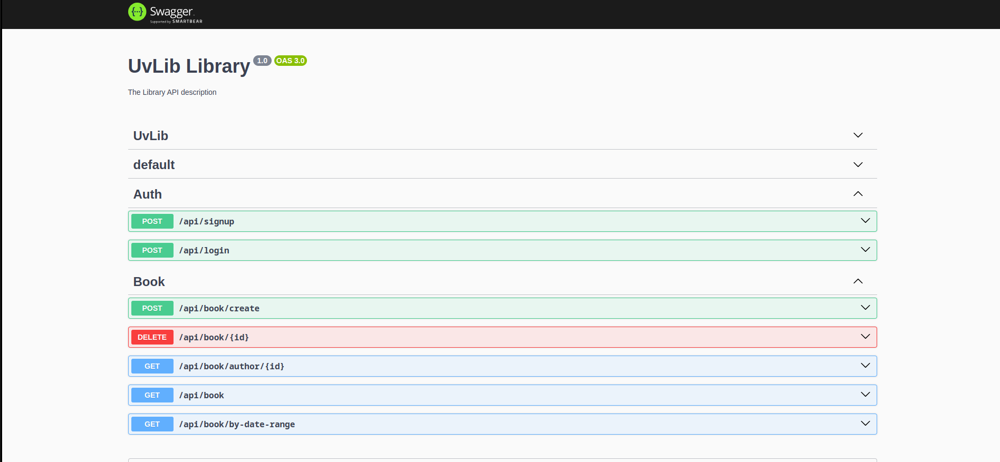

# UvLib - NestJS API


**UvLib** is an innovative library application designed for authors to register and showcase their books. It serves as a virtual library platform where authors can manage their literary works, making them accessible to readers worldwide. Authors can register on UvLib to upload details about their books, including titles, descriptions, publication dates, and more. 

## Installation

```bash
$ pnpm install
```

## Running the app

```bash
# development
$ pnpm run start

# watch mode
$ pnpm run start:dev

# production mode
$ pnpm run start:prod
```

### API Documentation (Swagger)

Creating API documentation using Swagger involves documenting endpoints, request parameters, response structures, and authentication methods in a structured format. Swagger provides a user-friendly interface for developers to understand and interact with the API, enhancing collaboration and integration across teams. By following Swagger's specifications, developers ensure clarity, consistency, and accessibility of the API documentation for seamless integration into various applications.



## Contribution

This repository is currently focused on core functionality and is not accepting additional feature contributions. The backend is designed to support client applications. However, you are welcome to contribute by addressing issues, adding tests, or making improvements that do not alter the exposed API's functionality or structure. If you are unsure whether a pull request would be accepted, feel free to open an issue to discuss it further.

